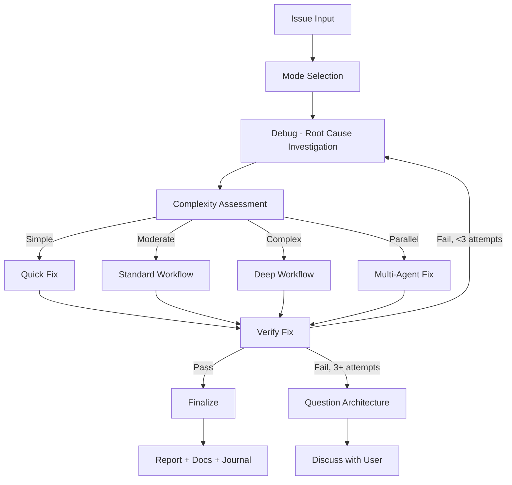

# Fixing

Unified skill for fixing issues of any complexity with intelligent routing.

## Arguments

- `--auto` - Activate autonomous mode (**default**)
- `--review` - Activate human-in-the-loop review mode
- `--quick` - Activate quick mode
- `--parallel` - Activate parallel mode: route to parallel `fullstack-developer` agents per issue

<HARD-GATE>
Do NOT propose or implement fixes before completing root cause investigation (Step 2: Debug).
Symptom fixes are failure. Find the cause first.
If 3+ fix attempts fail, STOP and question the architecture — discuss with user before attempting more.
User override: `--quick` mode allows fast debug→fix cycle for trivial issues (lint, type errors).
</HARD-GATE>

## Anti-Rationalization

| Thought | Reality |
|---------|---------|
| "I can see the problem, let me fix it" | Seeing symptoms ≠ understanding root cause. |
| "Quick fix for now, investigate later" | "Later" never comes. Fix properly now. |
| "Just try changing X" | Random fixes waste time and create new bugs. |
| "It's probably X" | "Probably" = guessing. Verify first. |
| "One more fix attempt" (after 2+) | 3+ failures = wrong approach. Question architecture. |
| "Emergency, no time for process" | Systematic debugging is FASTER than guess-and-check. |

## Process Flow (Authoritative)



**This diagram is the authoritative workflow.** If prose conflicts with this flow, follow the diagram.

## Workflow

### Step 1: Mode Selection

**First action:** If there is no "auto" keyword in the request, use `AskUserQuestion` to determine workflow mode:

| Option | Recommend When | Behavior |
|--------|----------------|----------|
| **Autonomous** (default) | Simple/moderate issues | Auto-approve if score >= 9.5 & 0 critical |
| **Human-in-the-loop Review** | Critical/production code | Pause for approval at each step |
| **Quick** | Type errors, lint, trivial bugs | Fast debug → fix → review cycle |

See `references/mode-selection.md` for AskUserQuestion format.

### Step 2: Debug

- Activate `ck:debug` skill.
- Guess all possible root causes.
- Spawn multiple `Explore` subagents in parallel to verify each hypothesis.
- Create report with all findings for the next step.

### Step 3: Complexity Assessment & Task Orchestration

Classify before routing. See `references/complexity-assessment.md`.

| Level | Indicators | Workflow |
|-------|------------|----------|
| **Simple** | Single file, clear error, type/lint | `references/workflow-quick.md` |
| **Moderate** | Multi-file, root cause unclear | `references/workflow-standard.md` |
| **Complex** | System-wide, architecture impact | `references/workflow-deep.md` |
| **Parallel** | 2+ independent issues OR `--parallel` flag | Parallel `fullstack-developer` agents |

**Task Orchestration (Moderate+ only):** After classifying, create native Claude Tasks for all phases upfront with dependencies. See `references/task-orchestration.md`.
- Skip for Quick workflow (< 3 steps, overhead exceeds benefit)
- Use `TaskCreate` with `addBlockedBy` for dependency chains
- Update via `TaskUpdate` as each phase completes
- For Parallel: create separate task trees per independent issue
- **Fallback:** Task tools (`TaskCreate`/`TaskUpdate`/`TaskGet`/`TaskList`) are CLI-only — unavailable in VSCode extension. If they error, use `TodoWrite` for progress tracking. Fix workflow remains fully functional without them.

### Step 4: Fix Implementation & Verification

- Implement fix per selected workflow, updating Tasks as phases complete.
- Spawn multiple `Explore` subagents to verify no regressions.
- Prevent future issues by adding comprehensive validation.

### Step 5: Finalize (MANDATORY - never skip)

1. Report summary: confidence score, changes, files
2. `docs-manager` subagent → update `./docs` if changes warrant (NON-OPTIONAL)
3. `TaskUpdate` → mark ALL Claude Tasks `completed` (skip if Task tools unavailable)
4. Ask user if they want to commit via `git-manager` subagent
5. Run `/ck:journal` to write a concise technical journal entry upon completion

---

## IMPORTANT: Skill/Subagent Activation Matrix

See `references/skill-activation-matrix.md` for complete matrix.

**Always activate:** `ck:debug` (all workflows)
**Conditional:** `ck:problem-solving`, `ck:sequential-thinking`, `ck:brainstorm`, `ck:context-engineering`, `ck:project-management` (moderate+ for task hydration/sync-back)
**Subagents:** `debugger`, `researcher`, `planner`, `code-reviewer`, `tester`, `Bash`
**Parallel:** Multiple `Explore` agents for scouting, `Bash` agents for verification

## Output Format

Unified step markers:
```
✓ Step 0: [Mode] selected - [Complexity] detected
✓ Step 1: Root cause identified - [summary]
✓ Step 2: Fix implemented - [N] files changed
✓ Step 3: Tests [X/X passed]
✓ Step 4: Review [score]/10 - [status]
✓ Step 5: Complete - [action taken]
```

## References

Load as needed:
- `references/mode-selection.md` - AskUserQuestion format for mode
- `references/complexity-assessment.md` - Classification criteria
- `references/task-orchestration.md` - Native Claude Task patterns for moderate+ workflows
- `references/workflow-quick.md` - Quick: debug → fix → review
- `references/workflow-standard.md` - Standard: full pipeline with Tasks
- `references/workflow-deep.md` - Deep: research + brainstorm + plan with Tasks
- `references/review-cycle.md` - Review logic (autonomous vs HITL)
- `references/skill-activation-matrix.md` - When to activate each skill
- `references/parallel-exploration.md` - Parallel Explore/Bash/Task coordination patterns

**Specialized Workflows:**
- `references/workflow-ci.md` - GitHub Actions/CI failures
- `references/workflow-logs.md` - Application log analysis
- `references/workflow-test.md` - Test suite failures
- `references/workflow-types.md` - TypeScript type errors
- `references/workflow-ui.md` - Visual/UI issues (requires design skills)
